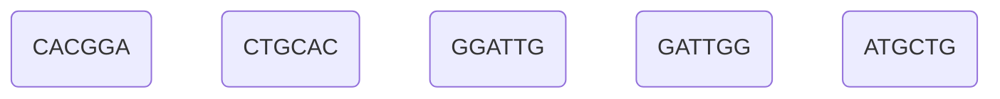
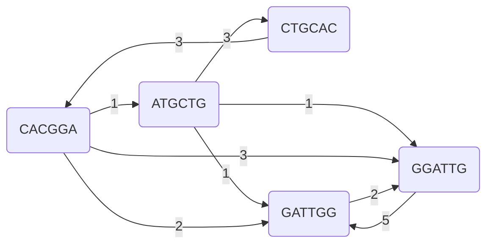
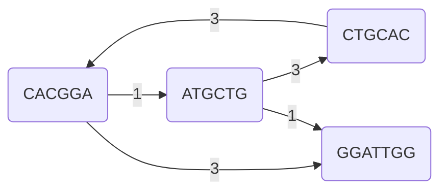
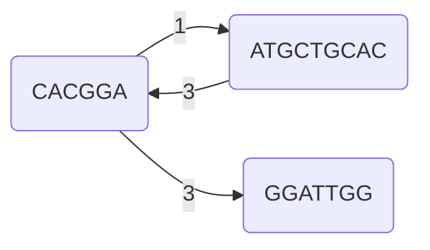
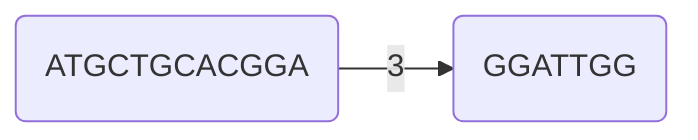
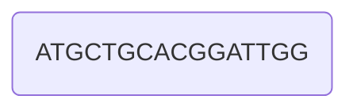
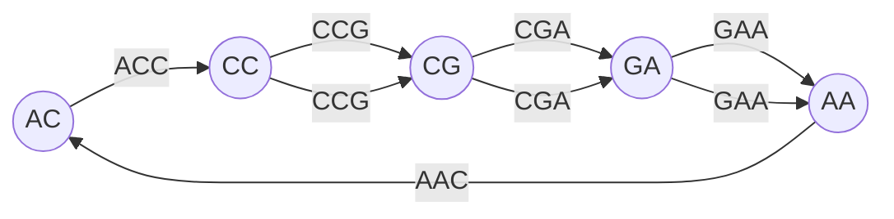

# Assembly Problems

Imagine you have found a set of reads from a sample (like small prokaryotic genomes) that you've collected _somewhere_.
This set of reads stems from some unknown sequence that has decayed due to degradation over time, sequencing errors, or fragmentation during the extraction process.

You may want to know what this unknown sequence looked like originally --- its structure, content, or function --- but all you have is a noisy, incomplete collection of short fragments.

Reconstructing the original sequence from these fragments is the central challenge of _sequence assembly_, a fundamental problem in bioinformatics.

!!! note "Assembly"

    Merging a set of reads in order to reconstruct an unknown sequence.

There are two types of Assembly.

!!! note "De novo Assembly ("from scratch")"

    Reconstructing the original sequence without reference, only from the reads.
    The goal is to find a suitable sequence that can be "derived" from the given reads.

!!! note "Reference-based Assembly ("mapping" or "alignment")"

    Assembling fragments regarding a reference sequence, to observe differences like mutations.

In this section, we will look at two graph-based approaches that perform a _De novo Assembly_:

- Greedy approach and
- De-Bruijn-Graph.

!!! note "$k$-mer"

    A **$k$-mer** is a substring of length $k$ from a longer sequence.
    For example, the $3$-mers of the sequence `ATGCG` are: `ATG`, `TGC`, and `GCG`.

    Each $k$-mer has:

    - a **prefix**: its first $k-1$ characters (e.g. for `TGC`, the prefix is `TG`)
    - a **suffix**: its last $k-1$ characters (e.g. for `TGC`, the suffix is `GC`)

    These prefixes and suffixes are crucial when constructing **Graphs**, where the overlaps are computed via $k-1$-mers.
    

## Simple Greedy Algorithm

!!! example "Example reads"

    Imagine you are given these reads: `CACGGA`, `CTGCAC`, `GGATTG`, `GATTGG`, `ATGCTG`.

The first step in this procedure is to visualise the fragments as graph nodes.



Then we can proceed to compute the overlap between all fragments.



We can now find the heaviest edge and merge the nodes iteratively, until only one node is left.
We will start with `GGATTG _> GATTGG`.

**Iteration 1** (merge `GGATTG`, `GATTGG`):



**Iteration 2** (merge `ATGCTG`, `CTGCAC`):


**Iteration 3** (merge `ATGCTGCAC`, `CACGGA`):


**Iteration 4** (merge `ATGCTGCACGGA`, `GGATTGG`):


...yielding
```
ATGCTG
   CTGCAC
      CACGGA
         GGATTG
          GATTGG
ATGCTGCACGGATTGG
```
where `ATGCTGCACGGATTGG` is our example genome of which we were given the five reads.

This greedy approach, however, focuses on local optimisation.
This may lead to problems in the assembly process.

!!! example "Greedy Assembly Pitfall Example"

    Let's say we have the following reads: `ACCG`, `CCGA`, `CGAA`, `GAAC`.

    Now let's look at the overlaps of length > 2:

    ```mermaid
        graph LR
            A("ACCG")
            B("CCGA")
            C("CGAA")
            D("GAAC")
        
            A -->|3| B
            B -->|3| C
            C -->|3| D
    ```
    
    A greedy algorithm would follow the longest ($3$-)overlaps first:

    ```
    ACCG _> CCGA _> CGAA _> GAAC
    ```

    resulting in the output sequence `ACCGAAC`, while the correct genome was maybe even `CCGAACCGAA` with the assembly path

    ```
    CCGA _> GAAC _> ACCG _> CGAA
    ```

    using only $2$-overlaps.

## De-Bruijn-Graphs for Sequence Assembly

De-Bruijn-Graphs are particularly useful when dealing with short reads.
This method can handle situations where greedy algorithms struggle, as it takes a more global approach to sequence assembly.

!!! note "Structure of a De-Bruijn-Graph"

    In a De-Bruijn-Graph:

    - the nodes represent the $(k-1)$-mers and
    - the edges represent the $k$-mers, where an edge from a node $A$ to a node $B$ is created **if** the suffix of $A$ overlaps with the prefix of $B$.

    Furthermore, the edges need to respect multiplicities, making De-Bruijn-Graphs Multigraphs.
    This graph effectively breaks down the problem of sequence assembly into a set of smaller pieces that can be more easily reconstructed.

    In general, a De-Bruijn-Graph looks like

    $$
    \begin{align*}
        \mathcal{M}_\mathrm{DBG} = \left(\bigcup_\ell\mathrm{M}[k - 1, \ell], E := \{(u_{k-1}, v_{k-1}) \in \mathrm{M}[k-1, \ell] \times \mathrm{M}[k-1, \ell] \mid u_{k-1}, v_{k-1} \in \mathrm{M}[k-1, \ell] \in \mathrm{M}[k]_\ell\}\right), \quad k \in \NN_{\geq 3}
    \end{align*}
    $$

    where $\mathrm{M}[k]$ is defined as the multiset of all $k$-mers that we're starting with, and $\mathrm{M}[k-1, \ell]$ the $k-1$-mers induced by the $\ell$-th $k$-mer $\mathrm{M}[k]_\ell$.
    $E$ is a multiset.

Continuing with the example reads from the previous example and a $k = 3$, the $k-1$ prefix and suffix of each $k$-mer will then form the nodes of the graph, with directed edges connecting them.



Once the graph is built, the next step is to find an _Eulerian path_ (or a _-tour_).
This path can be found in $\bigO(V+E)$ time using the _Hierholzer's algorithm_.
Applying this algorithm to this graph yields the path

```
CC _> CG _> GA _> AA _> AC _> CC _> CG _> GA _> AA
```

readible as the sequence

```
CCGA
  GAAC
    ACCG
      CGAA
CCGAACCGAA.
```

Reducing the "sensitivity" by setting $k = 4$ however, would again yield another result like `ACCGAAC`.
You can try it out.

Working with _Eulerian paths_, however, may introduce more problems.
Scaling the number of reads up drastically results in quickly rising numbers of possible assembly paths, safely pushing this problem into the set of _NP_-Complete problems.

Another concept one should be aware of are bubbles in De-Bruijn-Graphs.

!!! note "Bubbles in De-Bruijn-Graphs"

    A bubble in a De-Bruijn-Graph means a phenomenon, in which a path diverges into two paths, where the paths lead to mostly identical sub-sequences but a small difference.

Bubbles can occur when you find some fragments of two or more genome sequences, where at least one of those sequences contains mutations.

!!! example "Bubble in a De-Bruijn-Graph"

    Given two fragments `...ACCG TCCC...`, `...ACCG CCC...` and assuming that either an _insertion mutation_ happened in the first one and/or a _deletion mutation_ has occured in the second one,
    we get the $5$-mers `ACCGC`, `ACCGT`, `CGTCC`, `CGCCC` and `TCCCC`.
    The according $4$-mers are `ACCG`, `CCGC`, `ACCG`, `CCGT`, `CGTC`, `GTCC`, `CGCC`, `GCCC` and `TCCC`, resulting for $k=4$ in a subgraph

    ```mermaid
    graph LR
        ghost_start:::hidden
        ACC(("ACC"))
        CCG(("CCG"))
        CGT(("CGT"))
        GTC(("GTC"))
        TCC(("TCC"))
        CGe(("CG\epsilon"))
        GeC(("G\epsilonC"))
        eCC(("\epsilonCC"))
        CCC(("CCC"))
        ghost_end:::hidden

        ghost_start -.- ACC
        ACC -->|ACCG| CCG
        ACC -->|ACCG| CCG
        CCG -->|CCG**T**| CGT
        CGT -->|CG**T**C| GTC
        GTC -->|G**T**CC| TCC
        TCC -->|**T**CCC| CCC
        CCG -->|GCC**\epsilon**| CGe
        CGe -->|CG**\epsilon**C| GeC
        GeC -->|G**\epsilon**CC| eCC
        eCC -->|**\epsilon**CCC| CCC
        CCC -.- ghost_end

        classDef hidden display: none;
    ```

    to which an algorithm detecting _Eulerian paths_ wouldn't report a result.